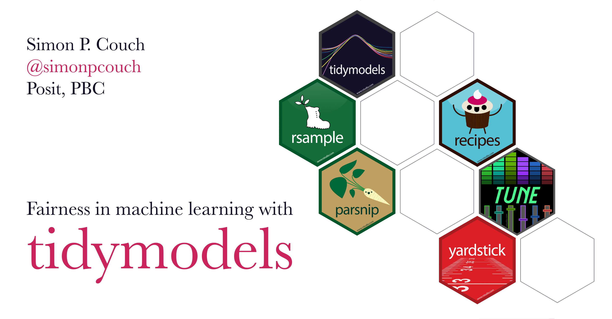

This repository contains source code and slides for the talk "Fairness in machine learning" at the Salt Lake City R User Group in December 2023.

* The **slides** for the talk are available [here](https://simonpcouch.github.io/slc-rug-23).
* The **example analysis** that these slides are based on is available [here](https://deploy-preview-48--tidymodels-org.netlify.app/learn/work/fairness-detectors/).
* Another **example analysis** demonstrating a fairness-oriented modeling workflow is [here](https://deploy-preview-52--tidymodels-org.netlify.app/learn/work/fairness-readmission/).

To learn more about data science and machine learning with R,

- Data science with the tidyverse: [r4ds.hadley.nz](r4ds.hadley.nz)
- Machine learning with tidymodels: [tmwr.org](tmwr.org)
- More example notebooks with tidymodels: [tidymodels.org](tidymodels.org)

----

These slides use the development version of some tidymodels packages. To install the packages needed to run this code yourself, use the following R code:

```r
# if needed:
install.packages("pak")

# install the tidymodels meta-package
pak::pak("tidymodels")

# install the development versions of yardstick and tune
pak::pak(paste0("tidymodels/", c("yardstick", "tune"))

# install the source data
pak::pak("detectors")
```

----

In this repository,

-   `index.qmd` contains the source code for the slides. The slides use images in the `/figures` directory.
-   `/docs` is auto-generated from `index.qmd`. Content in that folder is likely unhelpful for a human reader, and is better viewed at the links above. :)
